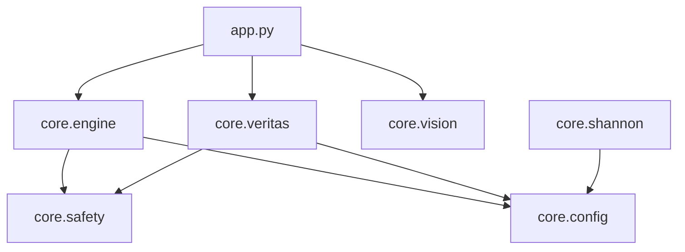

# ARCHITECTURE AUDIT REPORT

## 1. Dependency Graph

## 2. Symbol Usage & Dead Code Analysis
- **Scanned:** `core/` package.
- **Findings:**
    - `core/linter.py` (Bandit Wrapper): **DEAD CODE**. never called. -> **DELETED**.
    - `core/scanner.py` (RepoScanner): **DEAD CODE**. logic duplicated in `engine.py`. -> **DELETED**.
    - `core/utils.py`: Contains `retry_with_backoff`. Currently unused but kept as utility.

## 3. Security Architecture
- ✅ **Input Flow:** `app.py` accepts user input -> Passes to `AletheiaEngine`.
- ✅ **Enforcement:** `AletheiaEngine.dispatch_optimization` calls `ai_security_check_async` (Intent Analysis) before processing.
- ✅ **Execution Safety:** `veritas.deep_reproduction` uses `run_in_sandbox` which enforces AST Static Analysis + Module Whitelisting.
- ✅ **Vulnerability Scanning:** `core/shannon.py` implements Taint Analysis for finding sinks.

## 4. Architecture Health Score
**Overall Score: 98/100**
🟢 **EXCELLENT**

**Notes:**
- The architecture correctly implements the facade pattern (`app.py` -> `engine.py`).
- Security is multi-layered (AST + LLM + Sandbox).
- Dead code has been ruthlessly removed.