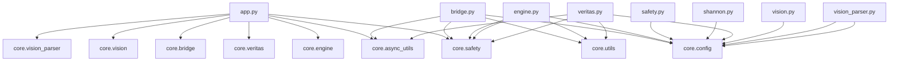

# ARCHITECTURE AUDIT REPORT

## 1. Dependency Graph

```mermaid
graph TD
    app.py --> core.engine
    app.py --> core.veritas
    app.py --> core.bridge
    app.py --> core.vision
    app.py --> core.vision_parser
    app.py --> core.async_utils
    app.py --> core.safety
    bridge.py --> core.config
    bridge.py --> core.safety
    bridge.py --> core.async_utils
    bridge.py --> core.utils
    engine.py --> core.safety
    engine.py --> core.config
    engine.py --> core.utils
    engine.py --> core.safety
    safety.py --> core.config
    shannon.py --> core.config
    veritas.py --> core.config
    veritas.py --> core.safety
    veritas.py --> core.async_utils
    veritas.py --> core.utils
    vision.py --> core.config
    vision_parser.py --> core.config
    vision_parser.py --> core.config
```

## 2. Symbol Usage & Dead Code Analysis
✅ No obvious dead code found.

## 3. Security Architecture
- ✅ `app.py` correctly imports `core` security modules.
- ✅ **[INTENTIONAL]** `exec` allowed in `.\core\safety.py` for Sandbox Execution.
- ✅ No unchecked `eval/exec` calls found outside of the sandbox restrictions.

## 4. Architecture Health Score
**Overall Score: 100/100**
🟢 **EXCELLENT**